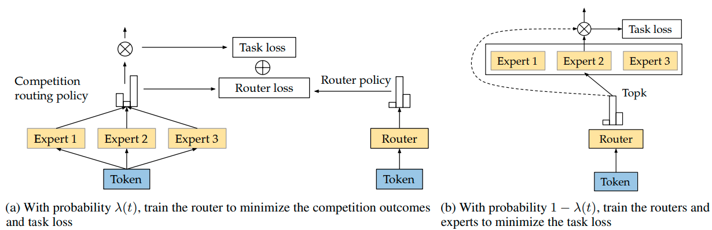

# CompeteSMoE - Effective Training of Sparse Mixture of Experts via Competition
[](https://opensource.org/licenses/MIT)

Code for the paper [CompeteSMoE - Effective Training of Sparse Mixture of Experts via Competition](https://arxiv.org/abs/2402.02526)</br>

Quang Pham, Giang Do, Huy Nguyen, TrungTin Nguyen, Chenghao Liu, Mina Sartipi, Binh T. Nguyen, Savitha Ramasamy, Xiaoli Li, Steven Hoi, Nhat Ho


## Overview

Sparse mixture of experts (SMoE) offers an appealing solution to scale up the model complexity beyond the mean of increasing the network's depth or width. However, effective training of SMoE has proven to be challenging due to the representation collapse issue, which causes parameter redundancy and limited representation potentials. In this work, we propose a competition mechanism to address this fundamental challenge of representation collapse. By routing inputs only to experts with the highest neural response, we show that, under mild assumptions, competition enjoys the same convergence rate as the optimal estimator. We further propose CompeteSMoE, an effective and efficient algorithm to train large language models by deploying a simple router that predicts the competition outcomes. Consequently, CompeteSMoE enjoys strong performance gains from the competition routing policy while having low computation overheads. Our extensive empirical evaluations on two transformer architectures and a wide range of tasks demonstrate the efficacy, robustness, and scalability of CompeteSMoE compared to state-of-the-art SMoE strategies.




## Prerequisites

- pytorch
- fastmoe: https://github.com/laekov/fastmoe

## Usage


##### Prepare Enwik8, Text8 and Wikitext-103 Datasets: 

- Download the enwik8, text8, wikitext-103 dataset from [here](https://github.com/laekov/fastmoe/blob/master/examples/transformer-xl/scripts/getdata.sh), then change bash scripts based on your local data paths.
```bash
data_folder/
└── pretraining
    └── enwik8
        ├── test.txt
        ├── train.txt
        └── valid.txt
    └── text8
        ├── test.txt
        ├── train.txt
        └── valid.txt
    └── wikitext-103
        ├── test.txt
        ├── train.txt
        └── valid.txt
```

- Select the SwitchTransformers or GLaM  architecture, its scale, and the type of SMoE layer. We support:

|                     | SMoE | SMoE-Dropout | XMoE | StableMoE | CompeteSMoE |
|---------------------|------|--------------|------|-----------|-------------|
| Transformer (S/M)   |  ✅  |     ✅       |  ✅  |     ✅    |      ✅     |
| GLaM (S/M)          |  ✅  |     ✅       |  ✅  |     ✅    |      ✅     |


##### Pretraining SwitchTransformers on Enwik8, Text8 and Wikitext-103: 

``` # Enwik8 dataset:
bash scripts/pretraining/enwik8/transformers/small/smoe-s.sh
bash scripts/pretraining/enwik8/transformers/small/smoe-dropout-s.sh 
bash scripts/pretraining/enwik8/transformers/small/xmoe-s.sh
bash scripts/pretraining/enwik8/transformers/small/stablemoe-s.sh    
bash scripts/pretraining/enwik8/transformers/small/competesmoe-s.sh 
```

``` # Text8 dataset: 
bash scripts/pretraining/text8/transformers/small/smoe-s.sh
bash scripts/pretraining/text8/transformers/small/smoe-dropout-s.sh 
bash scripts/pretraining/text8/transformers/small/xmoe-s.sh
bash scripts/pretraining/text8/transformers/small/stablemoe-s.sh    
bash scripts/pretraining/text8/transformers/small/competesmoe-s.sh 
```


``` # Wikitext103 dataset: 
bash scripts/pretraining/wikitext-103/transformers/small/smoe-s.sh
bash scripts/pretraining/wikitext-103/transformers/small/smoe-dropout-s.sh 
bash scripts/pretraining/wikitext-103/transformers/small/xmoe-s.sh
bash scripts/pretraining/wikitext-103/transformers/small/stablemoe-s.sh    
bash scripts/pretraining/wikitext-103/transformers/small/competesmoe-s.sh 
```

##### Pretraining GLaM on Enwik8, Text8 and Wikitext-103: 

``` # Enwik8 dataset:
bash scripts/pretraining/enwik8/glam/small/smoe-s.sh
bash scripts/pretraining/enwik8/glam/small/smoe-dropout-s.sh 
bash scripts/pretraining/enwik8/glam/small/xmoe-s.sh
bash scripts/pretraining/enwik8/glam/small/stablemoe-s.sh    
bash scripts/pretraining/enwik8/glam/small/competesmoe-s.sh 
```

``` # Text8 dataset: 
bash scripts/pretraining/text8/glam/small/smoe-s.sh
bash scripts/pretraining/text8/glam/small/smoe-dropout-s.sh 
bash scripts/pretraining/text8/glam/small/xmoe-s.sh
bash scripts/pretraining/text8/glam/small/stablemoe-s.sh    
bash scripts/pretraining/text8/glam/small/competesmoe-s.sh 
```


``` # Wikitext103 dataset: 
bash scripts/pretraining/wikitext-103/glam/small/smoe-s.sh
bash scripts/pretraining/wikitext-103/glam/small/smoe-dropout-s.sh 
bash scripts/pretraining/wikitext-103/glam/small/xmoe-s.sh
bash scripts/pretraining/wikitext-103/glam/small/stablemoe-s.sh    
bash scripts/pretraining/wikitext-103/glam/small/competesmoe-s.sh 
```


##### Fine-tuning on BANKING77, IMDb, SST-2, and SST-5:

```
bash scripts/finetuning/banking77/transformers/small/competesmoe-s.sh 
bash scripts/finetuning/imdb/transformers/small/competesmoe-s.sh 
bash scripts/finetuning/sst2/transformers/small/competesmoe-s.sh 
bash scripts/finetuning/sst5/transformers/small/competesmoe-s.sh 
```

## Acknowledgement

Our implementation is based on [fastmoe repo](https://github.com/laekov/fastmoe), [huggingface repo](https://github.com/huggingface/transformers) and [Sandwich Transformer](https://github.com/ofirpress/sandwich_transformer).

## Citation

```
@misc{pham2024competesmoe,
      title={CompeteSMoE -- Effective Training of Sparse Mixture of Experts via Competition}, 
      author={Quang Pham and Giang Do and Huy Nguyen and TrungTin Nguyen and Chenghao Liu and Mina Sartipi and Binh T. Nguyen and Savitha Ramasamy and Xiaoli Li and Steven Hoi and Nhat Ho},
      year={2024},
      eprint={2402.02526},
      archivePrefix={arXiv},
      primaryClass={cs.LG}
}
```

